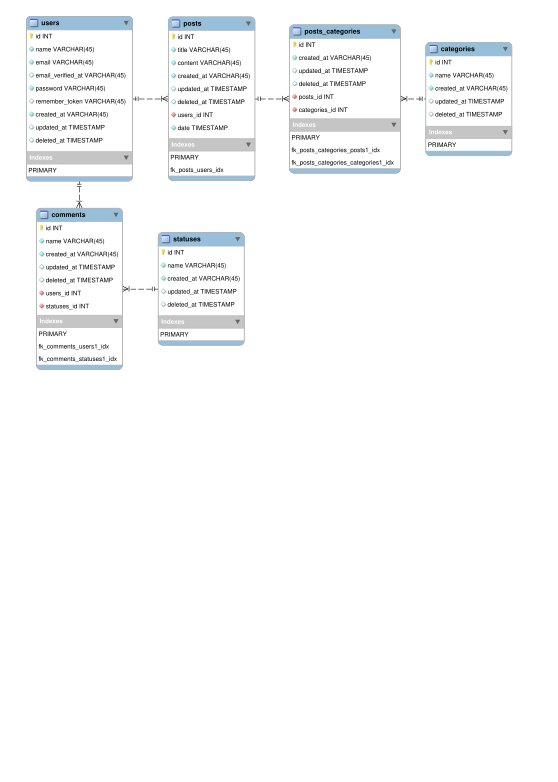

<h1 align="center">📨 Blog 📨</h1>

<p align="center">
    
    
    
    
</p>

<h2 align="center">Development of a blog project using </h2>

<h2 align="center">🪅 Create Project</h2>

```
    composer create-project --prefer-dist laravel/laravel blog
```

<h2 align="center">🪅 Migrations</h2>

```
    php artisan make:model Comments -mcr

    php artisan make:model Posts -mcr

    php artisan make:model Categories -mcr

    php artisan make:model Status -mcr
```

<h2 align="center">🪅 Entity Relationship Diagram (ERD)</h2>

<p align="center">
    
</p>